# GCP / GKE sample project

## GCP engines
**GCE (Google Compute engine)** is Google’s IaaS (Infrastructure as a Service) offering. GCE allows you to create your own virtual machine by allocating hardware-specific resources, e.g. RAM, CPU, Storage. It’s almost like building our own computer/workstation and handling all the details of running it.

**GKE (Google Kubernetes Engine)** is GCP’s Container as a Service (CaaS) offering, which allows customers to easily run their Docker containers in a fully managed Kubernetes environment. It provides you very fine grained control over everything about your cluster.

**GAE (Google App Engine)** runs your apps with as little configuration/management as possible.

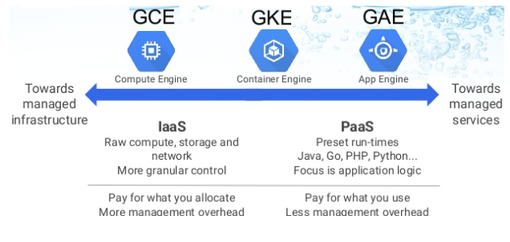

***
## GKE Architecture

### Cluster
A cluster consists of at least one cluster master and multiple worker machines called Nodes.
**Nodes** contain **Pods** and **Docker Containers**. These resources, whether for applications or batch jobs, are collectively called **Workloads**.

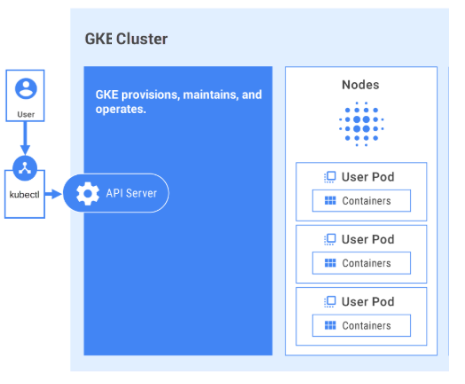

### Node pool
It is a group of nodes within a cluster that all have the same configuration.

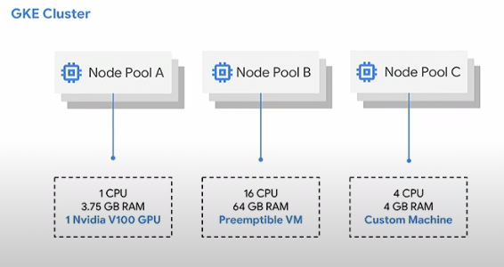

You can add additional custom node pools of different sizes, zones and types to your cluster. All nodes in any given node pool are identical to one another.

***
## Create GCP account

In your browser open the Google Cloud Console https://console.cloud.google.com/
If you are creating a new email account for GCP, make sure to go incognito or to logout other accounts.
It gives you US $300.00 credit to be spent over a year. That is, you have to be really careful on what you choose, specially on CPU and Memory.

***
## Create a Project

* Open the Cloud Console UI https://console.cloud.google.com and create a new project. My project's name is ** Sample Project GKE**
* Select the Project in the UI.
* Copy the project ID (ex: **sample-project-gke**)
* To select your project in the terminal, open Cloud Shell and select your project in the terminal:

    

***
### Install Google Cloud SDK to your laptop
With this SDK you can run gcloud from your local terminal instead of using the remote **Cloud Shell** terminal available in the browser.
Actually, I am not sure if you will need this local SDK in the future, but now you need to upload your local Docker Images to the **Container Registry** (This is the Google Image Registry).
Next, I will describe the SDK installation on Windows (recommended) and Ubuntu on WSL (Windows Subsystem for Linux).

#### Windows
* Install Docker Desktop for Windows. See https://docs.docker.com/docker-for-windows/install/
* Install Google Cloud SDK to your laptop - https://cloud.google.com/sdk/docs .
    > Google Cloud SDK command lines only work with windows terminal CMD. If you want it to work with Git Bash, you need to install Python.
* Start **Google Cloud SDK Shell** (I guess this is just a simple CMD terminal, I am really not sure)
* Make sure you are in the VPN because next step will config the VPN.
* Run ***gcloud init*** to connect to your GCP project (sample-project-gke)
* gcloud might throw an error due to VPN limitations:

    

* Config the VPN.
* After the VPN config, it requests your GCP credentials and the project to select (sample-project-gke). Configure local Docker to authenticate to GCP Container Registry (you need to run this only once): ***gcloud auth configure-docker***

#### Ubuntu on WSL (Windows Subsystem for Linux)

* Install Docker Desktop for Windows (Ubuntu will connect to it)
    * Install Docker Desktop for Windows. See https://docs.docker.com/docker-for-windows/install/
    * Righ click on the tray and select Settings
        
        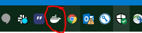

    * Righ click on the tray and select Settings
    * On General, check: **Expose daemon on tcp://localhost:2375 without TLS**. The Docker CLI in Ubunutu will refer to this Docker daemon. 

        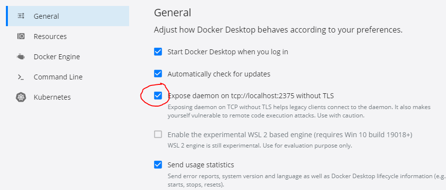
        > It mentions *use with caution* because it won't be encrypted (no TLS). However, do not bother with the vulnerability as you are exposing the Docker daemon only to your laptop.

* Ubuntu on WSL
    Source: https://nickjanetakis.com/blog/setting-up-docker-for-windows-and-wsl-to-work-flawlessly

    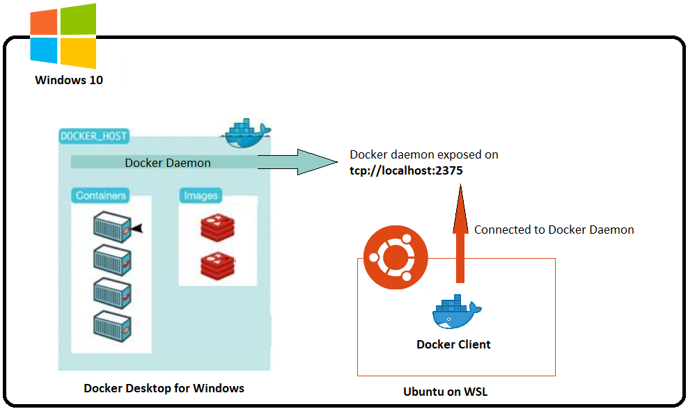
    > Ubuntu will be installed as a Windows subsystem, that is, it can share a few resources but it is still sort of indepent from Windows (I hope). \
    A Docker client will be added to Ubuntu and connected to the *Docker Desktop* via TCP. \
    The docker images and containers are maintained in the *Docker Desktop*.

    * Follow instructions on https://docs.microsoft.com/en-us/windows/wsl/install-win10 (Ubuntu 18.04 LTS)
    * Open the Ubuntu terminal
    * Update the apt package list: \
    **sudo apt-get update -y**
    * Install Docker's dependencies: \
    **sudo apt-get install -y apt-transport-https ca-certificates curl software-properties-common**
    * Download  Docker's public PGP key: \
    **curl -fsSL `https://download.docker.com/linux/ubuntu/gpg` | sudo apt-key add -**
    * Verify the fingerprint: \
    **sudo apt-key fingerprint 0EBFCD88**
    * Add the stable Docker upstream repository: \
    **sudo add-apt-repository "deb [arch=amd64] https://download.docker.com/linux/ubuntu $(lsb_release -cs) stable"**
    * Update the apt package list (for the new apt repo) \
    **sudo apt-get update -y**
    * Install the latest version of Docker \
    **sudo apt-get install -y docker-ce**
    * Allow your user to access the Docker CLI without root access \
    **sudo usermod -aG docker $USER**
    * For some reason you need to add **export PATH="$PATH:$HOME/.local/bin"** to your PATH. Open **~/.profile** and copy \
    **export PATH="$PATH:$HOME/.local/bin"**
    * Update your changes \
    **source ~/.profile**
    * Connect to the remote Docker daemon that has been exposed earlier at ***localhost:2375***. Open **~/.bashrc** and copy \
     **export DOCKER_HOST=tcp://localhost:2375**
    * Update your changes \
    **source ~/.bashrc**
    * Test Docker \
    **docker info**
    * Run ***gcloud init*** to connect to your GCP project (sample-project-gke). You may be asked to authenticate to your GCP account, then run **gcloud auth configure-docker**
    * List your GKE projects
    **gcloud projects list**

### Enable GKE and Billing

In the *Cloud Console*, make sure the project *Sample Project GKE* is selected.
In the left menu, go to *Kubernetes Engine*. Click on *Sign up for a free trial*. Notice that Google provides US$ 300 credit for 1 year and promises to not charge without your permission.

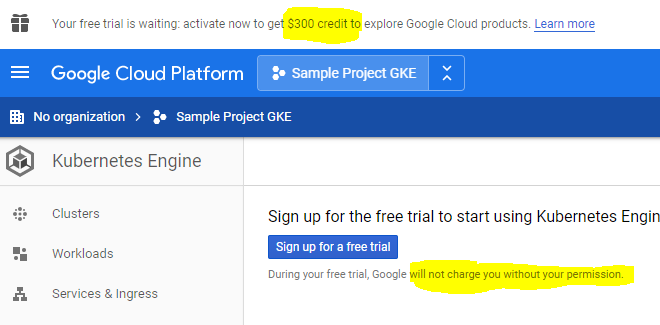

You will be asked to enable billing as well.

### Create a Cluster (Cloud Console)

The *GKE* environment consists of *Compute Engine* instances grouped together to form a cluster. \
A *Compute Engine* is a VM running in Google data centers, these VM's CPU and memory are scalable and configurable.\
You have to be really careful to create a cluster, because the *Compute Engine* cost depends on the CPU, memory, hardware and location. You don't want to spend all of your credits in an expensive VM.\
There is a list of *Compute Engine* locations, and only a few of them provide free tiers.\
These locations are based on Region and Zones.\
Example: ***us-west1-c*** (region=***us-west1***; zone=***c***)

*Compute Engine* free tier recommendations - For details check https://cloud.google.com/free/readme_images/gcp-free-tier
* Free ***f1-micro VM instance*** or the affordable ***n1-starndard-1***.
* Region: ***us-west1*** (The closest free option to Vancouver)

You have the ability to calculate monthly cost at https://cloud.google.com , select *Pricing* / *Calculators* \
Below is the comparasion of the costs of both VM's. You can try other configurations, but keep in mind that you have only US$ 300 yearly in credit.

**f1-micro VM instance** | **n1-standard-1**
--- | ---
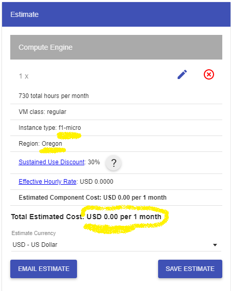| 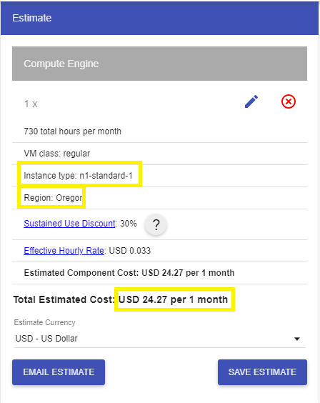

#### Enter Cluster info

To create the cluster, go to the *Cloud Console* / *Kubernetes Engine* / *Cluster* and click on *Create Cluster*. \
 Select
 * ***us-west1-c*** (Oregon)
 * ***Enable autoscaling***
 * ***n1-starndard-1*** (I've tried the free ***f1-Micro*** but it doesn't have enough memory)

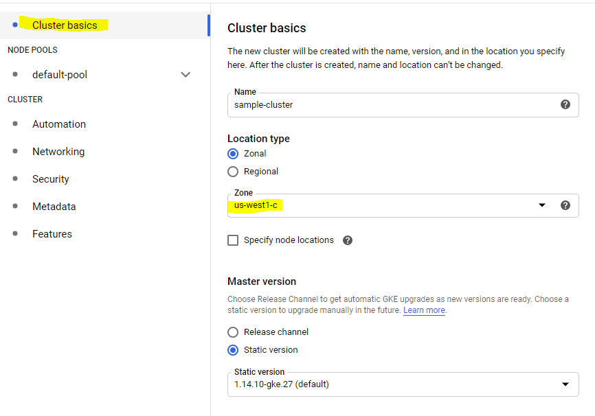

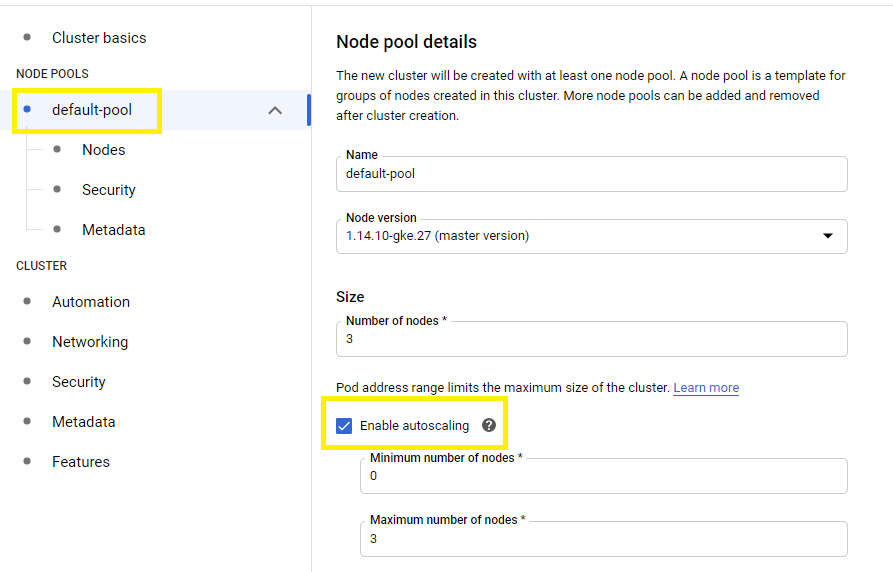

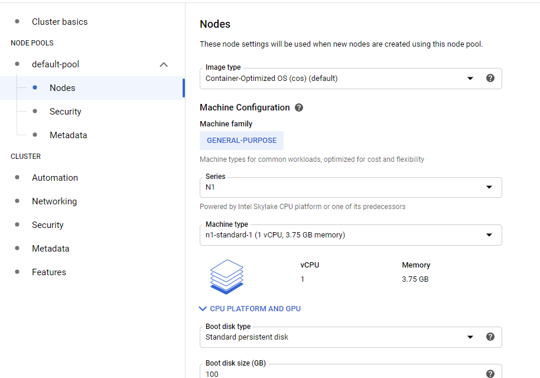

* Click on Create

### Connect to the cluster from local terminal

* In the Cloud Console, left menu, click on Kubertes / Cluster / Connect

    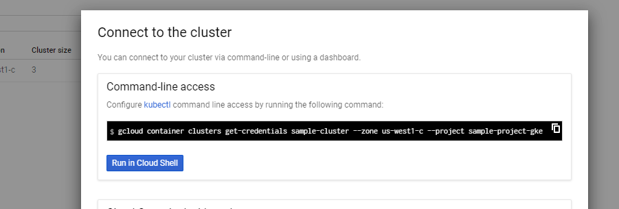

* Copy the gcloud command, paste it to your local terminal and run it. Your local *kubectl* should be connected now to your cluster.
* List your node pool: ***kubectl get nodes***
* You can also see your nodes in the Cloud Console. In the left menu, click on *Compute Engine* / *VM Instances*

### Create local image and push it to the cloud

* Clone the sample NodeJS project: https://github.com/fredaguiarteixeira/sample-gke
* Go to the project's root folder (For Ubuntu WSL: **cd /mnt/c/Users/t828913/dev/sample-gke**$).
* Build the local docker image: ***`docker build -t gcr.io/sample-project-gke/sample-gke:v1 .`*** (Including the period '.') \
    Where:
    *   ***`gcr.io`***: *gcr* stands for *Google Container Registry*. It is the target image registry.
    *   ***`sample-project-gke`***: The GCP Project.
    *   ***`sample-gke`***: The NodeJS Project.
    *   ***`v1`***: The image tag. It could be whatever you want, such as *latest, v1, v2, RC-V1, v.0.0.1, etc*.
    > VPN troubleshooting: If it is your first ever docker build you may have VPN issues because it will download a few images that are saved on your local docker registry, such as *node:lts-alpine*.
* To view the image you just created, run ***`docker images`***
* Push the image to the cloud: ***`docker push gcr.io/sample-project-gke/sample-gke:v1`***
* To view your uploaded image, go to the *Cloud Console / left menu / Tools section / Container Registry / Images*

    

* Create a Pod deployment
    * Go to the **/manifest** folder
    * Run ***kubectl apply -f deployment.yml***
    * Check if the pods are running: ***kubectl get pods***.

* Create a Service
    * Run ***kubectl apply -f services.yml***
    * Check if the service is ready (Not \<pending\>): ***kubectl get services***. \
    Manifest files:
        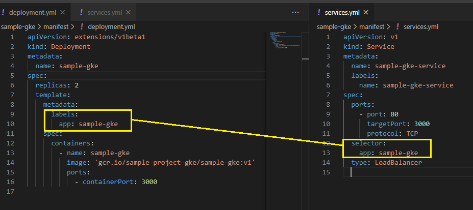
        The service exposes pods either internally in the cluster (type: **ClusterIP**), or externaly as a Load Balancer (type: **LoadBalancer**). \
        Pods and Services are linked through **labels** and **selectors**.

* FINALLY! Run the service

    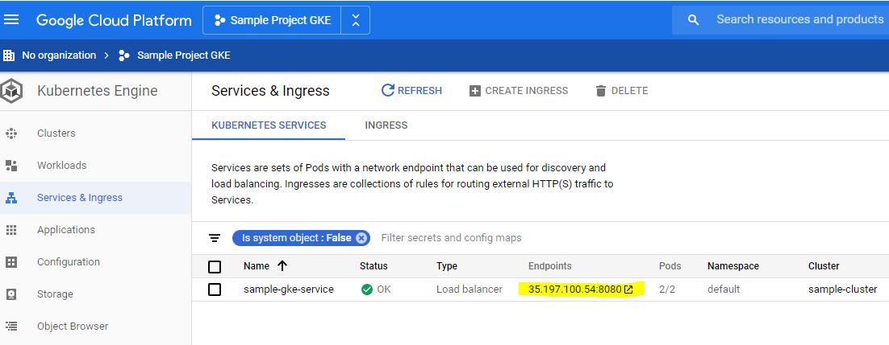
    It should display **Hello from sample-gke!**

### Ingress

Ingress is a router that expose multiple services under the same IP address, acting as a reverse proxy and single entry-point, with SSL support.
Ingress is NOT a type of service, and it is exposed as to the external traffic as a service type ***NodePort***.

Tipically, there are 3 types of services:
* **ClusterIP**: Exposes the Service on a ***cluster-internal*** IP. Choosing this value makes the Service only reachable from within the cluster..
* **NodePort**: Exposes the service to ***external traffic***. This is the most primitive way, it gives you service per port.
* **LoadBalancer**: Exposes the service to ***external traffic*** using the GKE load balancer.

If you are only exposing the services to the external traffic via Ingress, then it makes more sense to expose the services as **ClusterIP**.

In GKE there are 2 types of **Ingress Controllers**:
    **path**: 
        * mydomain.com/customer
        * mydomain.com/product
    **subdomain**:
        * customer.mydomain.com
        * product.mydomain.com

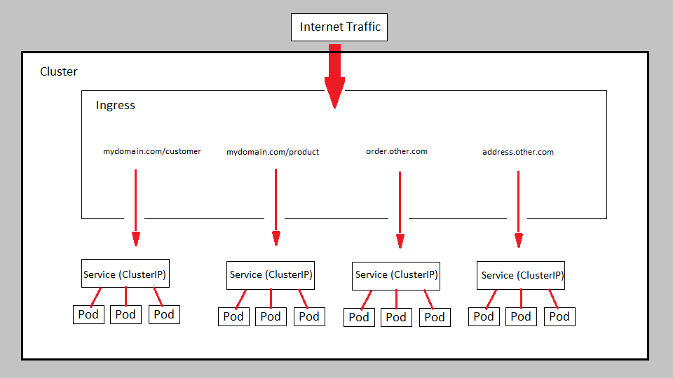

To better understand Ingress, you need to create another Deployment. Instead of writing manifest files, You can use the command line: \
Run 

***
***I'd strongly recommend you to delete the cluster once you are done. Most likely it will spend in a daily basis a few bucks from yours 300 yearly credit.*** \
***However, there might be a way to shut it down temporarily, or setup some sort or autoscale, etc.***
***

If you are planning on building projects this way, I'd recommend to install **Skaffold** https://github.com/GoogleContainerTools/skaffold \
This tool automatically builds and deploy local images to the cloud.
