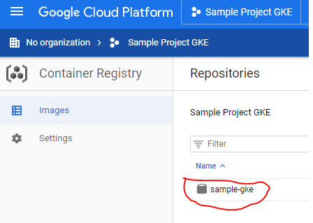

**GCP / GKE sample project**

***
## GCP engines
**GCE (Google Compute engine)** is Google’s IaaS (Infrastructure as a Service) offering. GCE allows you to create your own virtual machine by allocating hardware-specific resources, e.g. RAM, CPU, Storage. It’s almost like building our own computer/workstation and handling all the details of running it.

**GKE (Google Kubernetes Engine)** is GCP’s Container as a Service (CaaS) offering, which allows customers to easily run their Docker containers in a fully managed Kubernetes environment. It provides you very fine grained control over everything about your cluster.

**GAE (Google App Engine)** runs your apps with as little configuration/management as possible.

***
## GKE Architecture

### Cluster
A cluster consists of at least one cluster master and multiple worker machines called Nodes.
**Nodes** contain **Pods** and **Docker Containers**. These resources, whether for applications or batch jobs, are collectively called **Workloads**.

***
## Cluster Orchestration
The nodes, pods, containers and others are orchestrated by Kubernetes via Kubectl, gcloud and the Cloud Console.

* **Cloud Shell** is a shell environment for managing resources hosted on Google Cloud. It comes with kubectl and gcloud.

* **Kubectl** is a command-line client that calls the Kubernetes APIs. It provides the primary command-line interface for running commands against Kubernetes clusters.

* **gcloud** is a tool that provides the primary command-line interface for Google Cloud, and kubectl provides the primary command-line interface for running commands against Kubernetes clusters.

* **Cloud Console**: You can also use the UI instead of Kubectl and gcloud.

***
## Create a GCP Project

* Open the Cloud Console UI https://console.cloud.google.com and create a new project. My project's name is **Zinc Proton**
* Select the Project in the UI.
* Copy the project ID (ex: **zinc-proton-272919**)
* To select your project in the terminal, open Cloud Shell and select your project in the terminal:

    

* then run ***gcloud config set project zinc-proton-272919***
* Enable GCE (Google Compute Engine)
    
    

***
## Deploy an application (From your local Docker)

### Create a Cluster
You can create a cluster in either the command line or in the Cloud Console UI. Go to Kubernetes Engine / Cluster and click on Create Cluster
I would recommend creating everything from now on in the same Region and Zone.
Example: ***us-central1-c*** (region: ***us-central***; zone: ***c***)

### Install Google Cloud SDK to your laptop
With this SDK you can run gcloud from your local terminal instead of using the remote **Cloud Shell** terminal available in the browser.
Actually, you may never need this local SDK in the future, but now you need to upload your local Docker Images to the **Container Registry** (This is the Google Image Registry).
Next, I will describe the SDK installation on Windows and Ubuntu on WSL (Windows Subsystem for Linux).

#### Windows
* Install Docker Desktop for Windows. See https://docs.docker.com/docker-for-windows/install/
* Install Google Cloud SDK to your laptop - https://cloud.google.com/sdk/docs .
    > Google Cloud SDK command lines only work with windows terminal CMD. If you want it to work with Git Bash, you need to install Python.
* Start **Google Cloud SDK Shell** (I guess this is just a simple CMD terminal, I am really not sure)
* Make sure you are in the VPN because next step will config the VPN.
* Run ***gcloud init*** to connect to your GCP project (zinc-proton-272919)
* gcloud might throw an error due to VPN limitations:

    

* Config the VPN.
* After the VPN config, it requests your GCP credentials and the project to select (zinc-proton-272919). Configure local Docker to authenticate to GCP Container Registry (you need to run this only once): ***gcloud auth configure-docker***

#### Ubuntu on WSL (Windows Subsystem for Linux)

* Docker Desktop for Windows
    * Install Docker Desktop for Windows. See https://docs.docker.com/docker-for-windows/install/
    * Righ click on the tray and select Settings
        
        

    * Righ click on the tray and select Settings
    * On General, check: **Expose daemon on tcp://localhost:2375 without TLS**. The Docker CLI in Ubunutu will refer to this Docker daemon. 

        
        > It mentions *use with caution* because it won't be encrypted (no TLS). However, do not bother with the vulnerability as you are exposing the Docker daemon only to your laptop.
* Ubuntu on WSL

    
    > Ubuntu will be installed as a Windows subsystem, that is, it can share a few resources but it is still sort of indepent from Windows (I hope). \
    A Docker client will be added to Ubuntu and connected to the *Docker Desktop* via TCP. \
    The docker images and containers are maintained in the *Docker Desktop*.

    * Follow instructions on https://docs.microsoft.com/en-us/windows/wsl/install-win10 (Ubuntu 18.04 LTS)
    * Open the Ubuntu terminal
    * Update the apt package list: \
    **sudo apt-get update -y**
    * Install Docker's dependencies: \
    **sudo apt-get install -y apt-transport-https ca-certificates curl software-properties-common**
    * Download  Docker's public PGP key: \
    **curl -fsSL `https://download.docker.com/linux/ubuntu/gpg` | sudo apt-key add -**
    * Verify the fingerprint: \
    **sudo apt-key fingerprint 0EBFCD88**
    * Add the stable Docker upstream repository: \
    **sudo add-apt-repository "deb [arch=amd64] https://download.docker.com/linux/ubuntu $(lsb_release -cs) stable"**
    * Update the apt package list (for the new apt repo) \
    **sudo apt-get update -y**
    * Install the latest version of Docker \
    **sudo apt-get install -y docker-ce**
    * Allow your user to access the Docker CLI without root access \
    **sudo usermod -aG docker $USER**
    * For some reason you need to add **export PATH="$PATH:$HOME/.local/bin"** to your PATH. Open **~/.profile** and copy \
    **export PATH="$PATH:$HOME/.local/bin"**
    * Update your changes \
    **source ~/.profile**
    * Connect to the remote Docker daemon that has been exposed earlier at ***localhost:2375***. Open **~/.bashrc** and copy \
     **export DOCKER_HOST=tcp://localhost:2375**
    * Update your changes \
    **source ~/.bashrc**
    * Test Docker \
    **docker info**
    * Run ***gcloud init*** to connect to your GCP project (zinc-proton-272919). You may be asked to authenticate to your GCP account, then run **gcloud auth configure-docker**
    * List your GKE projects
    **gcloud projects list**

### GCP Authentication
* In case you need to login again: ***gcloud auth login***

### Create the image
* Enable the Container Registry for your project (Zinc Proton). Try either following options, I am really not sure what I‘ve done to get this working:
    * https://console.cloud.google.com/apis/library/containerregistry.googleapis.com
    * Or go to menu Tools / Container Registry

* In the Google Cloud SDK terminal, go to the root folder of the sample-gke project. If it is your first ever docker build you may have VPN issues.
* Build the local docker image [ `docker build -t GCP_CONTAINER_REGISTRY/PROJECT_ID/IMAGE_NAME:TAG .` ]. Example: ***`docker build -t gcr.io/zinc-proton-272919/sample-gke:v1 .`***
* To view the image you just created: ***`docker images`***
* Push your image to the *GCP Container Registry*: ***docker push gcr.io/zinc-proton-272919/sample-gke:v1***

### Upload the image
* Configure local Docker to authenticate to GCP Container Registry (you need to run this only once): ***gcloud auth configure-docker***
* In case you need to login again: ***gcloud auth login***
* To make sure you are logged in, you can list the GKE projects: ***gcloud projects list***
* Push the image: ***`docker push gcr.io/zinc-proton-272919/sample-gke:v1`***
* To view your uploaded image, go to the GCP console, in the menu, go to the *Tools* section, select *Container Registry / Images*

    

### Deploy Image

